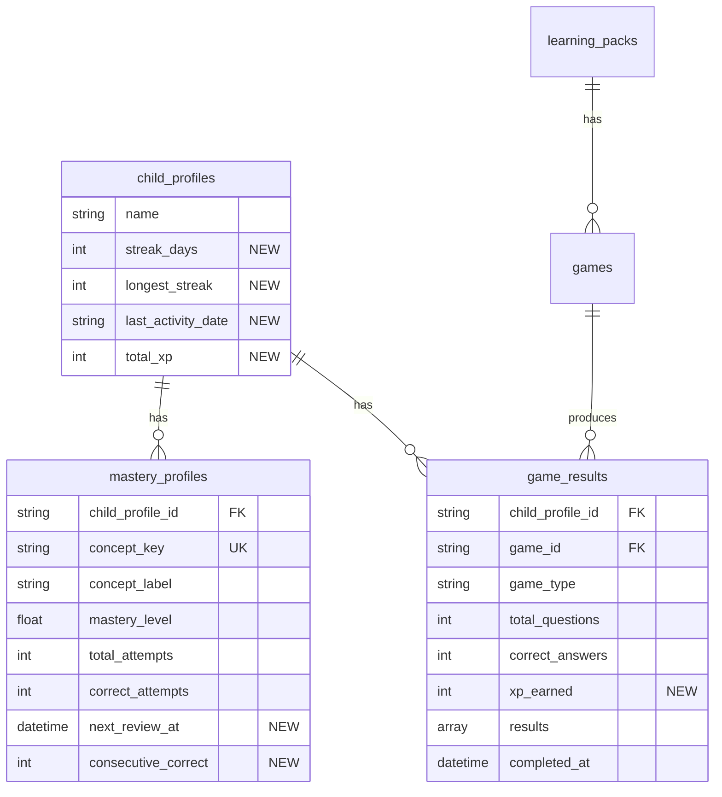

# Complete Quiz & Learning Pipeline: Photo to Mastery

## Overview

Close the feedback loop so Learny becomes a real learning system: game results persist, the app knows what the child knows, and it tells them what to study next.

**Scope**: Wire game results to backend, add persistent streaks/XP, implement simple review scheduling, show mastery on packs.

**Out of scope** (for now): FSRS algorithm, achievements system, daily challenges, adaptive difficulty tiers, cross-concept questions, content library screen, revision express mode. These go in the icebox until we have real usage data.

**Deferred**: User onboarding/auth, parent dashboard analytics, offline mode, social features.

## Problem Statement

1. **Game results are never sent to the backend** -- `BackendClient` has no `submitGameResult()` method
2. **Mastery tracking is fake** -- client-side only, resets on app restart
3. **No persistent streaks/XP** -- gamification counters are in-memory only
4. **No review queue** -- there's no "what should I study today?"
5. **Concept extraction uses a stub** -- `StubConceptExtractor` is bound in production
6. **`topic` vs `concept_key` gap** -- AI games use free-form `topic`, mastery uses `concept_key`

## Architecture Decisions (from review)

Based on three independent reviews, the following decisions were made:

1. **No new MongoDB collections.** Streak/XP fields go on `ChildProfile`. Review queue is a query on `mastery_profiles`, not a separate collection.
2. **No separate jobs for mastery updates.** Update `MasteryProfile` inline in `GameResultController` -- it's just incrementing counters.
3. **No FSRS for v1.** Use naive intervals (wrong=1 day, right=3 days, right twice=7 days). Upgrade to FSRS when we have retention data.
4. **No response_time_ms tracking.** Not needed for naive intervals. Add later if FSRS requires it.
5. **Use MongoDB atomic `$inc` operations** for streak/XP to prevent race conditions from concurrent submissions.
6. **Bridge `topic` to `concept_key`** by constraining AI prompts to use exact concept keys from the learning pack.
7. **Await game result response** (not fire-and-forget) so we can show streak/XP on the results screen. Degrade gracefully on timeout.

## Data Model Changes

**No new collections. No new models. Just new fields on existing models.**

## API Changes

| Method | Endpoint | Change |
|--------|----------|--------|
| POST | `.../games/{game}/results` | **Enhance**: update mastery + streak/XP inline, return gamification data |
| GET | `.../review-queue` | **New**: query mastery_profiles where `next_review_at <= now()` |
| GET | `.../learning-packs` | **Enhance**: include average mastery per pack |
| GET | `.../children/{child}` | **Enhance**: include streak_days, total_xp in response |

**1 new endpoint. 3 enhanced endpoints. That's it.**

---

## Implementation Steps

### Step 1: Close the Loop (1-2 days)

**Goal**: Game results flow from Flutter to backend, mastery and streaks update.

#### 1.1 Bridge `topic` to `concept_key` in game generation

**File**: `backend/app/Services/Generation/PrismGameGenerator.php`

- [x] Add concept keys from the learning pack to the game generation prompt
- [x] Instruct the AI: "Use these exact concept_key values in the `topic` field of each question"
- [x] This ensures game payloads use canonical keys that match `MasteryProfile.concept_key`

#### 1.2 Add `submitGameResult()` to Flutter BackendClient

**File**: `mobile/learny_app/lib/services/backend_client.dart`

- [x] Add method: `Future<Map<String, dynamic>?> submitGameResult(childId, packId, gameId, payload)`
- [x] Payload: `game_type`, `results` (per-question: `correct`, `topic`, `selected_answer`, `correct_answer`), `total_questions`, `correct_answers`, `completed_at`
- [x] Return response data (streak, XP) or null on failure

#### 1.3 Call `submitGameResult` from AppState on game completion

**File**: `mobile/learny_app/lib/state/app_state.dart`

- [x] After quiz/flashcard/matching session completes, call `submitGameResult()`
- [x] Await response with 10s timeout, degrade gracefully on failure
- [x] If response contains `streak_days` and `total_xp`, update local state
- [x] Map each question's `topic` field as the concept identifier

#### 1.4 Update mastery + streak + XP inline in GameResultController

**File**: `backend/app/Http/Controllers/Api/GameResultController.php`

- [x] After storing `GameResult`, for each question result:
  - `MasteryProfile::updateOrCreate()` for `(child_profile_id, topic)` using atomic `$inc` for `total_attempts` and `correct_attempts`
  - Recompute `mastery_level = correct_attempts / total_attempts`
  - Set `next_review_at`: incorrect = +1 day, correct = +3 days. If `consecutive_correct >= 2`, set +7 days
  - Track `consecutive_correct`: increment on correct, reset to 0 on incorrect
- [x] Calculate XP: `correct_answers * 10` (flat rate, no multipliers)
- [x] Update streak on `ChildProfile` using atomic `$inc`:
  - If `last_activity_date` == today: no change
  - If `last_activity_date` == yesterday: `streak_days += 1`
  - Else: `streak_days = 1`
  - Update `longest_streak = max(longest_streak, streak_days)`
  - Set `last_activity_date = today`
- [x] Atomically increment `total_xp` on `ChildProfile`
- [x] Return: `{ data: $record, streak_days, total_xp, xp_earned }`

#### 1.5 Add new fields to ChildProfile model

**File**: `backend/app/Models/ChildProfile.php`

- [x] Add to `$fillable`: `streak_days`, `longest_streak`, `last_activity_date`, `total_xp`
- [x] Default values: 0, 0, null, 0

#### 1.6 Add new fields to MasteryProfile model

**File**: `backend/app/Models/MasteryProfile.php`

- [x] Add to `$fillable`: `next_review_at`, `consecutive_correct`
- [x] Add `$casts`: `'next_review_at' => 'datetime'`, `'consecutive_correct' => 'integer'`

#### 1.7 Replace fake gamification data in Flutter

**File**: `mobile/learny_app/lib/state/app_state.dart`

- [x] On app load / after game result: use backend `streak_days` and `total_xp`
- [x] Remove or bypass fake `streakDays += 1` and `xpToday += 5` logic
- [x] Keep fake data as fallback when backend is unavailable

**Acceptance Criteria**:
- After completing any game, the result is persisted on the backend
- `MasteryProfile` records are created/updated for each concept
- Streak counter persists across app restarts
- XP accumulates on the backend
- Results screen shows real XP earned and streak count

---

### Step 2: Simple Review Queue (1-2 days)

**Goal**: Children see what needs reviewing and can start a review session.

#### 2.1 Add review queue endpoint

**File**: `backend/app/Http/Controllers/Api/ReviewQueueController.php` (new)

- [x] `GET /v1/children/{child}/review-queue`
- [x] Query: `MasteryProfile::where('child_profile_id', $child)->where('next_review_at', '<=', now())->orderBy('next_review_at', 'asc')->limit(20)->get()`
- [x] Return: array of `{ concept_key, concept_label, mastery_level, next_review_at }`
- [x] Include `total_due` count in response metadata

#### 2.2 Add route

**File**: `backend/routes/api.php`

- [x] Add `GET /v1/children/{child}/review-queue` -> `ReviewQueueController@index`

#### 2.3 Show review prompt on home screen

**File**: `mobile/learny_app/lib/screens/home/home_screen.dart`

- [x] Fetch review queue count on home load
- [x] If > 0, show a card: "You have N concepts to review" with a "Review Now" button
- [x] Tapping launches a game session from an existing learning pack that contains those concepts

#### 2.4 Fetch and display review queue in AppState

**File**: `mobile/learny_app/lib/state/app_state.dart`

- [x] Add `reviewDueCount` property
- [x] Fetch from `/review-queue` on init and after game completion
- [x] Use count to drive the home screen card

**Acceptance Criteria**:
- After playing games, concepts get scheduled for review
- Home screen shows "N concepts to review" when items are due
- Tapping review launches a game session with due concepts

---

### Step 3: Pack Mastery Display (0.5 days)

**Goal**: Show mastery progress on learning pack cards.

#### 3.1 Enhance learning packs endpoint

**File**: `backend/app/Http/Controllers/Api/LearningPackController.php`

- [x] When listing packs, query `MasteryProfile` for each pack's concepts
- [x] Compute average `mastery_level` across the pack's concepts
- [x] Return `mastery_percentage` and `concepts_mastered` / `concepts_total` in the pack response

#### 3.2 Show mastery on pack cards in Flutter

**File**: `mobile/learny_app/lib/screens/home/home_screen.dart`

- [x] Display mastery percentage on each pack card (simple progress bar + percentage)
- [x] Use mastery data from the enhanced packs endpoint

**Acceptance Criteria**:
- Each learning pack shows its mastery percentage
- Mastery updates after completing games

---

## Files Summary

### Backend (new: 1 file)

| File | Purpose |
|------|---------|
| `app/Http/Controllers/Api/ReviewQueueController.php` | Review queue endpoint |

### Backend (modified: 5 files)

| File | Changes |
|------|---------|
| `app/Models/ChildProfile.php` | Add streak_days, longest_streak, last_activity_date, total_xp |
| `app/Models/MasteryProfile.php` | Add next_review_at, consecutive_correct |
| `app/Http/Controllers/Api/GameResultController.php` | Inline mastery + streak + XP updates |
| `app/Http/Controllers/Api/LearningPackController.php` | Add mastery summary to pack listing |
| `app/Services/Generation/PrismGameGenerator.php` | Bridge topic to concept_key |
| `routes/api.php` | Add review-queue route |

### Flutter (modified: 4 files)

| File | Changes |
|------|---------|
| `lib/services/backend_client.dart` | Add submitGameResult(), fetchReviewQueue() |
| `lib/state/app_state.dart` | Wire real streak/XP, add reviewDueCount |
| `lib/screens/games/results_screen.dart` | Show real XP/streak from response |
| `lib/screens/home/home_screen.dart` | Review card, mastery on packs |

**Total: 1 new file, 10 modified files.**

---

## Icebox (Build Later, With Data)

These features are well-designed but premature. Revisit when we have 2+ weeks of real usage data:

| Feature | Trigger to Build |
|---------|-----------------|
| FSRS algorithm | Naive intervals proven insufficient by retention data |
| Streak freezes | Children abandoning app after broken streaks |
| Achievement system | Children completing games but not returning daily |
| Daily challenges | Review queue not driving enough daily opens |
| Adaptive difficulty (5 tiers) | Children bored with same-difficulty questions |
| Content library screen | Children have 10+ packs and can't find things |
| Revision Express mode | Quick review button proves popular |
| XP multipliers / 25 levels | Flat XP not motivating enough |
| Cross-concept questions | Children mastering many concepts in same subject |

---

## Risk Analysis

| Risk | Mitigation |
|------|-----------|
| OpenRouter API 500s | Already mitigated: retry with exponential backoff |
| Concurrent game submissions corrupt streak/XP | Use MongoDB atomic `$inc` and `findOneAndUpdate` |
| `topic` doesn't match `concept_key` | Constrain AI prompts to use exact concept keys from learning pack |
| Review game generation latency | Reuse existing games from the learning pack (no new AI generation for reviews) |

## References

- Existing game result controller: `backend/app/Http/Controllers/Api/GameResultController.php`
- Existing mastery model: `backend/app/Models/MasteryProfile.php`
- Existing child profile: `backend/app/Models/ChildProfile.php`
- Flutter state: `mobile/learny_app/lib/state/app_state.dart`
- Flutter backend client: `mobile/learny_app/lib/services/backend_client.dart`
