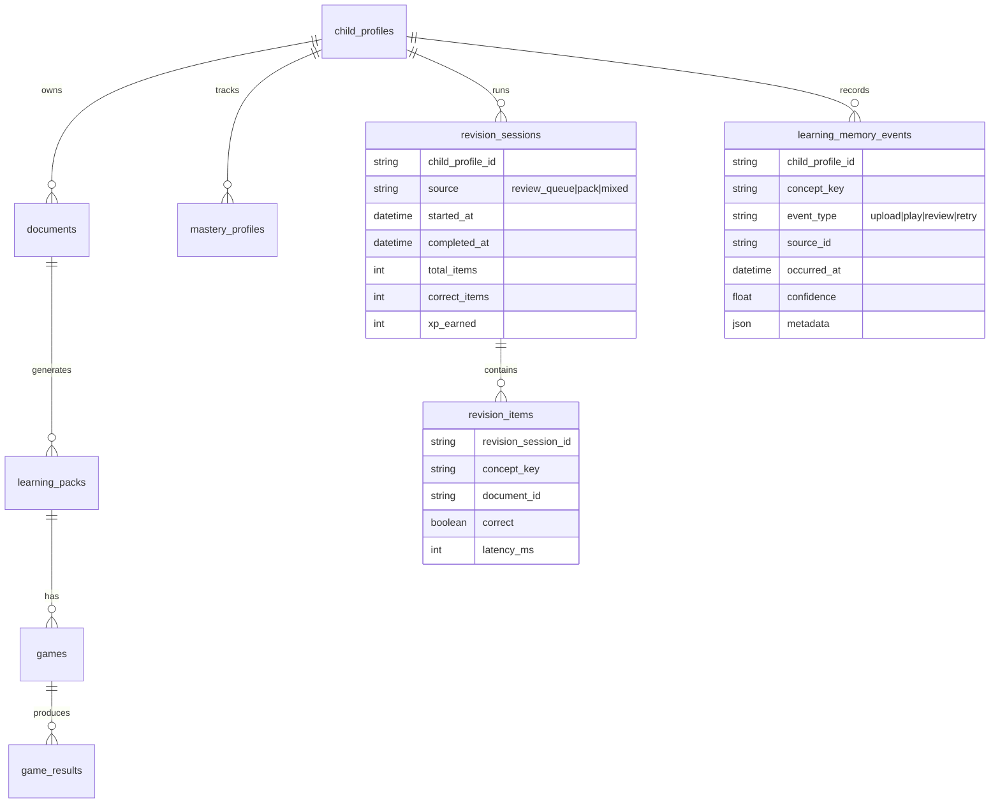

# ✨ feat: Smart Revision, Faster Uploads, and Persistent Learning Memory

## Enhancement Summary

**Deepened on:** 2026-02-06  
**Sections enhanced:** 8  
**Research agents used:** repo/local code scan + external benchmark scan (Fyxer, WHOOP, OpenAI, Anthropic, Google Gemini, Perplexity, Notion, Superhuman)

### Key Improvements

1. Added a market benchmark layer to ground product decisions in proven AI-memory patterns.
2. Added an explicit remaining-items task list with sequencing, dependencies, and owner-ready scope.
3. Added memory governance requirements (control, transparency, and privacy-safe defaults) to reduce trust risk.

### New Considerations Discovered

- Products with highest trust combine AI suggestions with fast user confirmation loops.
- Leading AI memory systems expose controls for edit/delete/disable and clear scope boundaries.
- Engagement systems improve when memory signals are tied to immediate “next best action” moments.

## Overview

This plan addresses four connected product questions:

1. Is Quick Revision using past uploaded documents effectively?
2. How do we reduce upload-to-first-game waiting time?
3. How do we make metadata capture interactive, AI-assisted, and low-friction?
4. How do we build a memory mechanic that persists across the full learner journey?

Short answer today: Quick Revision is **not** fully connected to past uploaded documents and backend memory; it currently uses local fake prompts.

## Section Manifest (Deepen Pass)

Section 1: Current gaps and recent commit coverage - confirm what is solved vs still missing.  
Section 2: External benchmarks - how AI-first products handle memory, context, and feedback loops.  
Section 3: Revision architecture - backend session composition from real learning artifacts.  
Section 4: Upload speed path - reduce TTFQ with staged readiness and fast-start behavior.  
Section 5: Metadata UX - AI-assisted contextualization with user-confirmed edits.  
Section 6: Memory mechanism - evented learner memory across upload, quiz, and revision.  
Section 7: Methodical execution checklist - implementation order and quality gates.  
Section 8: Risk and measurement - telemetry, safety, and trust controls.

## Idea Refinement

No relevant brainstorm file was found in `docs/brainstorms/`.

The feature description is already detailed and action-oriented, so planning proceeds directly.

## Local Research Summary

### Repo Findings (Key Evidence)

- Revision Express currently loads prompts from fake repositories, not backend document-derived content:
  - `mobile/learny_app/lib/state/app_state.dart:320`
  - `mobile/learny_app/lib/data/fake_repositories.dart:57`
  - `mobile/learny_app/lib/data/fake_data.dart:185`
- Revision setup is a lightweight UI shell with fixed 5-minute framing; no due-concept orchestration in that screen:
  - `mobile/learny_app/lib/screens/revision/revision_setup_screen.dart:15`
- Upload/review flow requires manual context entry (`subject` or `learning_goal`) before proceeding:
  - `mobile/learny_app/lib/screens/documents/review_screen.dart:47`
  - `mobile/learny_app/lib/screens/documents/upload_screen.dart:44`
  - `backend/app/Http/Controllers/Api/DocumentController.php:54`
- Upload processing experience is poll-based with exponential backoff and long timeout windows (3-5 min):
  - `mobile/learny_app/lib/state/app_state.dart:601`
  - `mobile/learny_app/lib/state/app_state.dart:608`
  - `mobile/learny_app/lib/state/app_state.dart:696`
- Backend pipeline is asynchronous and multi-stage, but status granularity is coarse (`queued|processing|processed|failed`):
  - `backend/app/Http/Controllers/Api/DocumentController.php:97`
  - `backend/app/Jobs/ProcessDocumentOcr.php:31`
  - `backend/app/Jobs/ExtractConceptsFromDocument.php:59`
  - `backend/app/Jobs/GenerateLearningPackFromDocument.php:59`
- Memory primitives already exist (mastery updates + review queue), but no dedicated revision-session persistence:
  - `backend/app/Http/Controllers/Api/GameResultController.php:108`
  - `backend/app/Http/Controllers/Api/ReviewQueueController.php:18`
  - `backend/routes/api.php:40`

### Institutional Learnings

No `docs/solutions/` entries were found for this topic.

### Recent Commit Coverage

Latest commit reviewed: `d42d944` ("Close remaining pipeline gaps for mastery and concept extraction").

What it improved:
- Strengthened concept extraction and mastery/review queue plumbing:
  - `backend/app/Services/Concepts/PrismConceptExtractor.php`
  - `backend/app/Http/Controllers/Api/ReviewQueueController.php`
  - `backend/app/Models/ChildProfile.php`
- Updated mobile state wiring:
  - `mobile/learny_app/lib/state/app_state.dart`

What remains open relative to this plan:
- Revision Express still not backend-generated from uploaded document concepts.
- Upload processing still lacks rich per-stage progress semantics in API/UI.
- Metadata remains manual-first rather than AI-suggest + confirm.
- Persistent memory events across full UX are not yet modeled end-to-end.

## Research Decision

External research is warranted because this request spans product UX, processing performance strategy, and memory science.

## External Research (Selected)

- Laravel queues/chains/batches for orchestrating staged async work and progress reporting:
  - [Laravel Queues 12.x](https://laravel.com/docs/12.x/queues)
- On-device text/language/entity extraction options to prefill metadata suggestions before upload:
  - [ML Kit Text Recognition v2 (iOS)](https://developers.google.com/ml-kit/vision/text-recognition/v2/ios)
  - [ML Kit Language Identification (iOS)](https://developers.google.com/ml-kit/language/identification/ios)
  - [ML Kit Entity Extraction (iOS)](https://developers.google.com/ml-kit/language/entity-extraction/ios)
- User-perceived latency thresholds to design processing UX feedback:
  - [RAIL model (web.dev)](https://web.dev/articles/rail)
- Evidence base for spacing + retrieval practice:
  - Cepeda et al. 2006 (meta-analysis) DOI: `10.1037/0033-2909.132.3.354`
  - Roediger & Karpicke 2006 DOI: `10.1111/j.1467-9280.2006.01693.x`

### How Others Are Doing It (2025-2026)

- Fyxer emphasizes human-in-the-loop automation: it triages/categorizes inboxes, drafts responses in user tone, and explicitly "learns from your actions" over time.
  - [Fyxer - How it works](https://fyxer.com/how-it-works)
- WHOOP Coach uses user-specific health/behavior data as context for personalized guidance, not generic tips.
  - [WHOOP Coach](https://www.whoop.com/us/en/thelocker/introducing-whoop-coach/)
- OpenAI memory separates saved memory and chat-history memory controls, with user-facing manage/delete controls.
  - [OpenAI Memory FAQ](https://help.openai.com/en/articles/8590148-memory-faq)
- Anthropic Claude memory applies project-scoped memory with explicit enable/disable controls and delayed propagation.
  - [Claude Memory](https://support.anthropic.com/en/articles/10185728-understanding-claude-s-memory)
- Google Gemini highlights personal context + temporary chats as paired personalization/privacy controls.
  - [Google Gemini context and controls](https://blog.google/products/gemini/temporary-chats-privacy-controls/)
- Perplexity memory supports profile preferences and conversation-derived memory with user visibility and deletion controls.
  - [Perplexity Memory](https://www.perplexity.ai/help-center/en/articles/10354919-memory)
- Notion AI improves answer quality by explicitly selecting trusted context sources (workspace pages + connected apps).
  - [Notion AI context sources](https://www.notion.com/help/use-your-docs-as-context-for-notion-ai)
- Superhuman combines AI triage + one-click response acceleration to reduce task-switching friction.
  - [Superhuman AI features](https://superhuman.com/ai)

## SpecFlow Analysis

### Primary User Flow

1. Parent captures/uploads one or more pages.
2. App provides AI metadata suggestions (subject/language/goal) with confidence.
3. Parent confirms/edits suggestions quickly.
4. Upload starts with live transfer progress and cancellable states.
5. Backend pipeline processes document and progressively surfaces stage state.
6. Child starts first available game quickly.
7. Results update mastery and due review queue.
8. Quick Revision session builds from due concepts tied to previous uploaded docs.
9. Memory loop personalizes next recommendations, reminders, and session ordering.

### Critical Edge Cases

- Low-confidence AI metadata suggestions (wrong subject/language).
- Parent skips metadata entirely.
- Multi-page uploads with mixed quality pages.
- OCR skipped for images while concept extraction still needs robust signal.
- Partial generation where one game type is ready but others lag/fail.
- Stale polling state after app background/foreground transitions.
- Revision session completed offline then resynced.
- Duplicate result submission during retry paths.

### Spec Gaps to Resolve

- Confidence thresholds and fallback behavior for AI-prefilled metadata.
- Definition of “Quick Revision from past docs” when due queue is empty.
- Memory model source-of-truth: event log vs direct mastery mutation only.
- Rules for cross-pack, cross-document revision composition.

## Issue Planning & Structure

### Title & Categorization

- Type: `feat`
- Title: `feat: Smart Revision, Faster Uploads, and Persistent Learning Memory`
- Filename: `docs/plans/2026-02-06-feat-smart-revision-upload-speed-memory-loop-plan.md`

### Stakeholders

- End users (parents, children): less friction, faster first value, better retention.
- Product/design: improved engagement loop and clarity in processing UX.
- Backend/mobile engineers: new APIs, state sync, pipeline observability.
- Operations: queue capacity, worker scaling, failure monitoring.

## Proposed Solution

### Product Decisions

1. Replace fake Revision Express prompts with backend-powered revision sessions.
2. Add AI metadata suggestion step immediately after capture/upload selection.
3. Reduce time-to-first-question (TTFQ) through fast-path generation and better pipeline orchestration.
4. Introduce persistent memory mechanics with evented learning history and concept-level scheduling.
5. Use `learning_memory_events` as the single write source-of-truth; compute mastery/review/recommendation as projections.
6. Deliver as one burst epic (all streams in parallel) behind feature flags and rollout gates.
7. Use temporary bound-user resolution for easier testing in non-production only, with hard production fail-fast guard.

### Non-Goals (Phase 1)

- Full FSRS implementation.
- Parent-facing analytics dashboard redesign.
- Social/gamified competition systems.

## Technical Approach

### Architecture

- Keep current pipeline and extend it with:
  - Metadata suggestion endpoint.
  - Revision session endpoints.
  - Processing stage telemetry and progress exposure.
  - Learning memory event model and recommendation query layer.
  - Projection contract: synchronous incremental updates on write + nightly reconciliation.
  - Environment-scoped child binding mode for dev/staging while preserving production-safe route scoping.

### ERD (Proposed Additions)

### Implementation Phases

#### Phase 1: Revision Reliability (Backend-Backed Quick Revision)

- Add endpoint `GET /v1/children/{child}/revision-session` that composes a short session from:
  - due review queue concepts,
  - latest packs and concepts,
  - recent wrong answers from `game_results`.
- Add endpoint `POST /v1/children/{child}/revision-session/{session}/results`.
- In Flutter, replace `_repositories.packs.loadRevisionPrompts(id)` with backend fetch.
- Persist revision outcomes and feed mastery update pipeline.
- Add temporary bound-user resolver (env flag) for non-production testing while keeping route contract unchanged.
- Add production guard: app boot fails if bound-user resolver is enabled in production.
- Enforce child ownership policy checks for all `/children/{child}` endpoints in production mode.

Pseudo files:
- `backend/app/Http/Controllers/Api/RevisionSessionController.php`
- `backend/app/Services/Revision/RevisionComposer.php`
- `backend/routes/api.php`
- `mobile/learny_app/lib/services/backend_client.dart`
- `mobile/learny_app/lib/state/app_state.dart`
- `mobile/learny_app/lib/screens/revision/revision_setup_screen.dart`

#### Phase 2: Upload Speed and Progress Experience

- Add server-side stage fields on documents (`pipeline_stage`, `stage_started_at`, `stage_completed_at`, `progress_hint`).
- Convert chained dispatch to explicit queue chain/batch orchestration for observability.
- Fast-start behavior: return first ready game immediately and let additional game types continue in background.
- Improve client UX:
  - separate transfer progress from processing stage progress,
  - actionable retries for failed stages,
  - avoid long opaque waits.

Pseudo files:
- `backend/app/Models/Document.php`
- `backend/app/Jobs/ProcessDocumentOcr.php`
- `backend/app/Jobs/ExtractConceptsFromDocument.php`
- `backend/app/Jobs/GenerateLearningPackFromDocument.php`
- `backend/app/Jobs/GenerateGamesFromLearningPack.php`
- `backend/app/Http/Controllers/Api/DocumentController.php`
- `mobile/learny_app/lib/state/app_state.dart`
- `mobile/learny_app/lib/screens/documents/processing_screen.dart`

#### Phase 3: AI-Assisted Metadata Confirmation

- Add `POST /v1/children/{child}/documents/metadata-suggestions`:
  - accepts local OCR snippet and/or low-res image thumbnail,
  - returns suggested `subject`, `language`, `learning_goal`, confidence, and alternatives.
- UI flow after capture:
  - show suggestions inline,
  - user confirms/edits quickly,
  - capture “accepted vs edited” as feedback for suggestion quality.
- Keep hard requirement: at least subject or learning goal before processing.

Pseudo files:
- `backend/app/Http/Controllers/Api/DocumentMetadataSuggestionController.php`
- `backend/app/Services/Documents/MetadataSuggestionService.php`
- `backend/routes/api.php`
- `mobile/learny_app/lib/screens/documents/review_screen.dart`
- `mobile/learny_app/lib/screens/documents/upload_screen.dart`
- `mobile/learny_app/lib/state/app_state.dart`

#### Phase 4: Persistent Memory Mechanic Across UX

- Introduce `learning_memory_events` as the only write path from uploads, games, retries, revisions.
- Derive concept memory signals:
  - retrieval strength,
  - recency decay,
  - mistake streak,
  - modality preference.
- Update projections in two modes:
  - synchronous incremental update after each event (fresh recommendations),
  - nightly reconciliation for consistency/backfill.
- Use these signals to power:
  - home recommendations,
  - revision composition,
  - “what to review now” nudges,
  - progress narrative for child and parent.

Pseudo files:
- `backend/app/Models/LearningMemoryEvent.php`
- `backend/app/Services/Memory/MemorySignalProjector.php`
- `backend/app/Services/Revision/RevisionComposer.php`
- `backend/app/Http/Controllers/Api/HomeRecommendationController.php`
- `mobile/learny_app/lib/screens/home/home_screen.dart`
- `mobile/learny_app/lib/state/app_state.dart`

### Research Insights by Workstream

#### Quick Revision on Past Uploaded Documents

**Best Practices**
- Build revision items from multiple memory signals: due queue + recent mistakes + freshness decay.
- Keep revision sessions short (5-10 prompts) and adaptive based on previous answer confidence.
- Persist each revision outcome as a first-class event so recommendations improve over time.

**Implementation Details**
- Add a deterministic ranking formula in `RevisionComposer` that weights:
  - due status (`review_queue`),
  - recency of wrong answers (`game_results`),
  - concept coverage from latest processed documents.
- Return `explainability` metadata per item (why selected) to support product debugging and trust.

**Edge Cases**
- Empty due queue: fallback to "recently weak" and "recently unseen" concept mix.
- Content sparsity after new account: bootstrap from latest pack-generated concept set.

#### Upload Speed and Processing Transparency

**Best Practices**
- Separate "upload transfer" from "AI processing" to reduce perceived waiting ambiguity.
- Expose stage-level progress and partial readiness (first playable content) instead of single terminal status.
- Track queue-to-worker latency and per-stage durations as first-class performance metrics.

**Performance Targets**
- P50 capture-to-first-question under 20s for one-page clean documents.
- P95 capture-to-first-question under 60s with degraded but clear fallback when generation partially fails.

**Implementation Details**
- Extend document response payload with:
  - `transfer_progress_percent`
  - `pipeline_stage`
  - `pipeline_stage_progress_percent`
  - `first_playable_ready_at`
  - `blocking_issue_code` (nullable)
- Introduce queue segmentation (`ocr`, `concepts`, `pack`, `games`) and autoscaling policy per lane.

#### AI-Assisted Metadata Confirmation

**Best Practices**
- Generate metadata suggestions immediately after capture using lightweight OCR/entity extraction.
- Present top suggestion + alternatives + confidence, then require one-tap confirmation before submit.
- Log "accepted/edited/rejected" outcomes to continuously improve metadata suggestion quality.

**Implementation Details**
- Add local preflight extraction on device (fast OCR snippet + language detect) before network roundtrip.
- Send compact features first (title-like text, dominant language, entities) and defer heavy image processing.
- Capture telemetry fields:
  - `metadata_suggestion_confidence`
  - `metadata_user_action`
  - `metadata_edit_distance`

**Edge Cases**
- Low-confidence (< threshold) responses must default to "needs confirmation" and avoid auto-apply.
- Mixed-language documents should allow explicit override without penalty.

#### Persistent Memory Mechanics Across the UX

**Best Practices**
- Use event-driven memory (`learning_memory_events`) rather than only mutable aggregate counters.
- Maintain user controls for memory scope and reset/delete operations to preserve trust.
- Derive "next best action" widgets directly from memory signals for immediate engagement impact.

**Implementation Details**
- Write memory events from:
  - document upload completion,
  - game question results,
  - revision responses,
  - retries and skips.
- Treat memory events as source-of-truth and projections as derived state only.
- Apply synchronous incremental projector updates per event for user-facing freshness.
- Build a nightly reconciliation projector job to repair drift and support backfills.
- Enforce event idempotency key and per-child monotonic ordering at write time.
- Add parent-facing controls:
  - clear memory for concept/document
  - pause personalization for a child profile
  - view "why this was recommended"

#### Engagement and Quiz/Revision Loop Optimization

**Best Practices**
- Convert every completed learning action into a clear next action within 1 tap.
- Use memory-informed nudges ("review 3 weak concepts now") instead of generic reminders.
- Keep challenge cadence adaptive: easy win first, then targeted weak-area retrieval.

**Implementation Details**
- Add home modules backed by memory scores:
  - `Ready in 3 min`
  - `Weak but improving`
  - `From yesterday's upload`
- Gate push notifications on confidence and recency to avoid fatigue.

## Remaining Items Task List (Burst Execution - All at Once)

### Track A - Revision Session and API Contract

- [x] Backend: implement `RevisionSessionController` and `RevisionComposer` composition logic.
- [x] Backend: add revision result write path + idempotency checks.
- [x] Mobile: replace fake revision prompt source in `app_state.dart`.
- [x] Tests: backend feature tests for session generation and submission payload validation.

### Track B - Upload Latency and Progressive Readiness

- [x] Backend: add stage/progress fields to document model and API response.
- [ ] Backend: separate queue lanes and capture per-stage timing telemetry.
- [ ] Mobile: display transfer progress and processing stage as separate UI elements.
- [ ] Mobile: allow entering first available game before full pipeline completion.
- [ ] Tests: pipeline stage transition and partial-ready regression suite.

### Track C - AI Metadata Suggestion and Confirmation

- [x] Backend: add metadata suggestion endpoint and confidence/alternatives schema.
- [x] Mobile: add interactive suggestion confirmation step in review flow.
- [ ] Telemetry: capture accepted/edited/rejected outcomes and confidence buckets.
- [ ] Tests: widget/state tests for low-confidence and edit-heavy paths.

### Track D - Memory Events, Projections, and Recommendations

- [x] Backend: create `LearningMemoryEvent` model + migration + writer hooks.
- [ ] Backend: enforce event idempotency and per-child monotonic ordering.
- [ ] Backend: implement sync incremental projector + nightly reconciliation.
- [x] Backend: expose home recommendation API with explainability metadata.
- [x] Mobile: integrate memory-driven home cards and revision prioritization.
- [ ] Governance: add memory controls (clear/pause/view-why) and policy copy updates.

### Track E - Bound User Mode for Fast Testing (Non-Production Only)

- [x] Backend: implement env-driven bound-user resolver (`BOUND_CHILD_PROFILE_ID`) for dev/staging.
- [x] Backend: preserve `/children/{child}` route shape while resolver is enabled.
- [x] Backend: hard fail startup if bound-user resolver is enabled in production.
- [x] Tests: production guard test + integration test for bound-mode behavior.

### Burst Gates (Must Pass Before Rollout)

- [ ] Gate 1: API contracts and telemetry event names are frozen.
- [ ] Gate 2: Revision session end-to-end works from real uploaded document concepts.
- [ ] Gate 3: Upload fast-start flow works with stage-level processing feedback.
- [ ] Gate 4: Metadata suggestion confirmation flow is stable under low-confidence cases.
- [ ] Gate 5: Memory event -> projection -> recommendation loop remains consistent (no drift).

### Release Readiness Checklist

- [ ] Define baseline metrics before rollout (TTFQ, upload abandonment, revision reuse).
- [ ] Keep all tracks behind feature flags until all burst gates pass.
- [ ] Add dashboards and alerts for queue latency, stage failures, and recommendation drift.
- [ ] Execute end-to-end smoke test: capture -> suggest -> confirm -> process -> play -> revise -> recommend.

## Alternative Approaches Considered

### Option A: Keep Revision Express fully local

Pros:
- Fast to ship.

Cons:
- Not tied to actual uploaded materials and real memory signals.
- No meaningful progression continuity.

Decision: Rejected.

### Option B: Full FSRS now

Pros:
- Advanced scheduling.

Cons:
- High implementation complexity before stable event telemetry.

Decision: Defer until memory event infrastructure is stable.

## Acceptance Criteria

### Functional Requirements

- [x] Quick Revision sessions are generated from backend data linked to uploaded documents.
- [x] Revision outcomes persist and update mastery/review scheduling.
- [x] Metadata is AI-prefilled post-capture, with explicit user confirmation/edit before submit.
- [ ] Upload flow exposes transfer progress + pipeline stage status distinctly.
- [ ] Child can begin first available game without waiting for all game types.
- [x] Memory signals influence home recommendations and revision queue composition.
- [ ] Parent can inspect and control memory personalization scope (view why, pause, clear).
- [x] Bound-user mode is available only in non-production environments, with identical route contract.

### Non-Functional Requirements

- [ ] Median TTFQ decreases by at least 40% from current baseline.
- [ ] P95 upload-to-ready pipeline time decreases by at least 25%.
- [ ] Metadata suggestion acceptance rate reaches >= 70% after tuning.
- [ ] No regression in idempotent game result processing.
- [ ] Recommendation click-through improves by >= 15% without increasing notification opt-out rate.
- [ ] Projection drift between memory events and derived recommendation state remains < 0.5%.

### Quality Gates

- [x] Backend feature tests for revision session generation and submission.
- [ ] Backend tests for pipeline stage transitions and partial readiness.
- [ ] Flutter state/widget tests for metadata suggestion confirmation flow.
- [ ] Flutter tests for processing-state UX and fast-start behavior.
- [ ] End-to-end smoke test: capture -> suggestion confirm -> process -> play -> revise.
- [ ] API contract tests for recommendation explainability and memory control endpoints.
- [x] Production guard test fails startup if bound-user mode is enabled in production.
- [ ] Consistency tests validate sync projection updates and nightly reconciliation parity.

## Success Metrics

- Revision reuse rate: % of children launching revision from due concepts.
- 7-day retention proxy: repeat correct on previously missed concepts.
- Upload abandonment rate from capture/review screens.
- Time from capture to first playable interaction.
- Daily active streak continuity and session completion rate.

## Dependencies & Prerequisites

- Queue worker reliability and capacity tuning.
- Mobile/background app state handling for long processing tasks.
- Privacy policy update for AI metadata suggestion processing (if image snippets are sent server-side).
- Feature flag framework for staged enablement across burst tracks.

## Risk Analysis & Mitigation

- Risk: wrong metadata suggestions harm trust.
  - Mitigation: show confidence + alternatives + one-tap edit.
- Risk: queue bottlenecks still dominate latency.
  - Mitigation: separate queue lanes, tune worker concurrency, add observability.
- Risk: memory model overfits noisy early data.
  - Mitigation: conservative scoring rules first, calibrate with telemetry.
- Risk: projection drift causes mismatch between event history and recommendations.
  - Mitigation: idempotent writes, monotonic ordering, sync projector updates, nightly reconciliation, drift monitor.
- Risk: bound-user mode accidentally leaks to production.
  - Mitigation: production boot guard + CI check + runtime alert.

## Documentation Plan

- Update API docs for:
  - revision session endpoints,
  - metadata suggestion endpoint,
  - document pipeline stage fields.
- Update Flutter flow docs for:
  - review/upload suggestion UX,
  - processing-stage UI contract,
  - revision state model.

## AI-Era Implementation Notes

- AI can draft metadata suggestions and revision item candidates, but user confirmation remains required.
- AI-generated prompts/content must pass schema validation and topic-key constraints before persistence.

## References & Research

### Internal References

- `mobile/learny_app/lib/state/app_state.dart:320`
- `mobile/learny_app/lib/data/fake_repositories.dart:57`
- `mobile/learny_app/lib/data/fake_data.dart:185`
- `mobile/learny_app/lib/screens/documents/review_screen.dart:47`
- `mobile/learny_app/lib/screens/documents/upload_screen.dart:44`
- `mobile/learny_app/lib/state/app_state.dart:601`
- `backend/app/Http/Controllers/Api/DocumentController.php:54`
- `backend/app/Jobs/ProcessDocumentOcr.php:31`
- `backend/app/Jobs/ExtractConceptsFromDocument.php:59`
- `backend/app/Jobs/GenerateLearningPackFromDocument.php:59`
- `backend/app/Http/Controllers/Api/GameResultController.php:108`
- `backend/app/Http/Controllers/Api/ReviewQueueController.php:18`
- `backend/routes/api.php:40`

### External References

- Laravel Queues: [https://laravel.com/docs/12.x/queues](https://laravel.com/docs/12.x/queues)
- web.dev RAIL: [https://web.dev/articles/rail](https://web.dev/articles/rail)
- ML Kit Text Recognition: [https://developers.google.com/ml-kit/vision/text-recognition/v2/ios](https://developers.google.com/ml-kit/vision/text-recognition/v2/ios)
- ML Kit Language ID: [https://developers.google.com/ml-kit/language/identification/ios](https://developers.google.com/ml-kit/language/identification/ios)
- ML Kit Entity Extraction: [https://developers.google.com/ml-kit/language/entity-extraction/ios](https://developers.google.com/ml-kit/language/entity-extraction/ios)
- Fyxer product patterns: [https://fyxer.com/how-it-works](https://fyxer.com/how-it-works)
- WHOOP Coach personalization: [https://www.whoop.com/us/en/thelocker/introducing-whoop-coach/](https://www.whoop.com/us/en/thelocker/introducing-whoop-coach/)
- OpenAI memory controls: [https://help.openai.com/en/articles/8590148-memory-faq](https://help.openai.com/en/articles/8590148-memory-faq)
- Anthropic Claude memory: [https://support.anthropic.com/en/articles/10185728-understanding-claude-s-memory](https://support.anthropic.com/en/articles/10185728-understanding-claude-s-memory)
- Google Gemini context controls: [https://blog.google/products/gemini/temporary-chats-privacy-controls/](https://blog.google/products/gemini/temporary-chats-privacy-controls/)
- Perplexity memory controls: [https://www.perplexity.ai/help-center/en/articles/10354919-memory](https://www.perplexity.ai/help-center/en/articles/10354919-memory)
- Notion AI workspace context: [https://www.notion.com/help/use-your-docs-as-context-for-notion-ai](https://www.notion.com/help/use-your-docs-as-context-for-notion-ai)
- Superhuman AI acceleration: [https://superhuman.com/ai](https://superhuman.com/ai)
- Cepeda et al. (2006) DOI: `10.1037/0033-2909.132.3.354`
- Roediger & Karpicke (2006) DOI: `10.1111/j.1467-9280.2006.01693.x`

### Related Work

- `docs/plans/2026-02-06-feat-complete-quiz-learning-pipeline-plan.md`
- `docs/plans/2026-02-06-fix-backend-game-result-idempotency-xp-persistence-plan.md`
