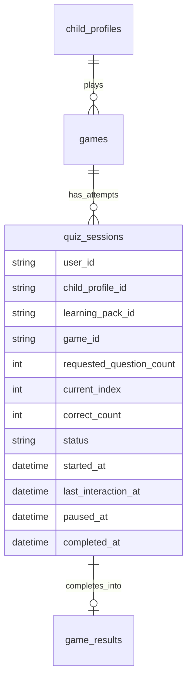

# ✨ feat: Configurable Quiz Length and Resumable In-Flight Quiz Sessions

## Overview

Add two connected capabilities to the quiz flow:

1. Let the learner choose quiz length before starting: minimum `5`, maximum `20` questions.
2. Let the learner leave a quiz in progress and resume it later without losing progress.

This plan includes UX, i18n copy, Flutter state updates, backend session persistence, and tests.

## Detail Level

`A LOT` (comprehensive, multi-phase feature with backend + mobile + i18n + QA)

## Stakeholders

- End users (children): control over quiz length, interruption-safe learning flow.
- Parents: fewer abandoned sessions, better completion continuity.
- Mobile developers: new setup/resume UI and state synchronization responsibilities.
- Backend developers: new session APIs, persistence lifecycle, idempotent completion path.
- QA/operations: new lifecycle coverage, checkpoint reliability, and monitoring checks.

## Idea Refinement

- No brainstorm file was found in `docs/brainstorms/`.
- The request is clear enough to proceed directly.
- Scope interpreted as: apply question-count picker to the quiz game flow (`type=quiz`) and persist resumable progress server-side.

## Local Research Summary

### Repo Findings

- Quiz loading and progression are currently in-memory only (`QuizSession`), no persisted in-flight checkpoint:
  - `mobile/learny_app/lib/models/quiz_session.dart:3`
  - `mobile/learny_app/lib/state/app_state.dart:1384`
  - `mobile/learny_app/lib/state/app_state.dart:1674`
- Quiz completion is submitted only at the end of the run:
  - `mobile/learny_app/lib/state/app_state.dart:1844`
  - `mobile/learny_app/lib/services/backend_client.dart:430`
- Backend has no quiz-session resource yet; only final result ingestion:
  - `backend/routes/api.php:73`
  - `backend/app/Http/Controllers/Api/GameResultController.php:159`
- Backend already has a persisted session pattern (`revision_sessions`) with idempotent replay semantics that we can mirror:
  - `backend/app/Http/Controllers/Api/RevisionSessionController.php:20`
  - `backend/app/Models/RevisionSession.php:8`
  - `backend/tests/Feature/RevisionSessionTest.php:18`
- Quiz schema currently allows any size `>=1`, so no guardrails for the requested `5..20` UX range:
  - `backend/resources/schemas/game_quiz.json:15`
- Existing i18n infra is ready and supports EN/FR/NL ARB strings:
  - `mobile/learny_app/lib/l10n/app_en.arb:52`
  - `mobile/learny_app/lib/l10n/app_fr.arb:30`
  - `mobile/learny_app/lib/l10n/app_nl.arb:30`
- Existing “fun text” pattern already exists in processing flow and is localized:
  - `mobile/learny_app/lib/screens/documents/processing_screen.dart:289`

### Institutional Learnings

- No `docs/solutions/` entries exist yet for this topic.

## Research Decision

Proceeding without external research. This feature is low-risk and the repository already contains strong local patterns for:
- session persistence (`revision_sessions`),
- idempotent completion,
- localization architecture.

## Problem Statement

Current quiz sessions are volatile and fixed by generated payload size. Learners cannot:
- pick a preferred session length (short vs longer focus),
- safely exit and continue later.

This reduces flexibility and increases frustration when interrupted.

## Proposed Solution

Introduce a persisted `quiz_sessions` backend resource and a quiz setup UI on mobile.

- Before quiz start, learner chooses question count (`5..20`) via a fun localized picker.
- Backend creates an active quiz session that stores selected question indices and progress.
- Mobile autosaves after each answered question.
- Learner can explicitly “Save & Exit”.
- On next entry, app offers resume and continues from last answered question.
- Final completion closes the session and submits canonical game result once.

## Technical Approach

### Architecture



### API Design (v1)

- `POST /api/v1/children/{child}/learning-packs/{pack}/games/{game}/quiz-sessions`
  - Create or return active session.
  - Body: `{ "question_count": 5..20 }`
- `GET /api/v1/children/{child}/quiz-sessions/active`
  - Return active/paused quiz session for the child (most recent).
- `PATCH /api/v1/children/{child}/quiz-sessions/{session}`
  - Save progress checkpoint.
  - Body includes `current_index`, `correct_count`, appended `results` item, `status` (`active|paused`).
- `POST /api/v1/children/{child}/quiz-sessions/{session}/complete`
  - Finalize session, persist `game_results` once, return XP/streak payload.

### Data Model

New model: `QuizSession` (Mongo collection: `quiz_sessions`)

- Required fields:
  - `user_id`, `child_profile_id`, `learning_pack_id`, `game_id`
  - `requested_question_count` (int)
  - `question_indices` (array<int>)
  - `results` (array)
  - `current_index`, `correct_count`
  - `status` (`active`, `paused`, `completed`, `abandoned`)
  - timestamps (`started_at`, `last_interaction_at`, `paused_at`, `completed_at`)
- Indexes:
  - `['child_profile_id', 'status', 'last_interaction_at']`
  - `['child_profile_id', 'game_id', 'status']`

### Question Count Rules

- Client and backend both enforce `min=5`, `max=20`.
- Backend validates requested count at session creation.
- Session freezes selected question indices at creation to keep resume deterministic.
- Selection strategy: deterministic shuffle by session id + take N.

## Implementation Phases

### Phase 1: Backend Quiz Session Foundation

Files:
- `backend/app/Models/QuizSession.php` (new)
- `backend/app/Http/Controllers/Api/QuizSessionController.php` (new)
- `backend/routes/api.php`
- `backend/database/migrations/2026_02_08_00000X_create_quiz_session_indexes.php` (new)
- `backend/tests/TestCase.php`

Tasks:
- [x] Add `QuizSession` model with fillable/casts.
- [x] Add create/get-active/patch-progress endpoints.
- [x] Validate `question_count` between 5 and 20.
- [x] Persist `question_indices` at creation time.
- [x] Add Mongo indexes for active session lookup and status filtering.
- [x] Add `quiz_sessions` collection cleanup in backend test base.

Pseudo-code:

```php
// backend/app/Http/Controllers/Api/QuizSessionController.php
$validated = $request->validate([
  'question_count' => ['required', 'integer', 'min:5', 'max:20'],
]);

$session = QuizSession::create([
  'child_profile_id' => (string) $child->_id,
  'game_id' => (string) $game->_id,
  'requested_question_count' => $validated['question_count'],
  'question_indices' => $this->pickQuestionIndices($game->payload, $validated['question_count']),
  'current_index' => 0,
  'correct_count' => 0,
  'results' => [],
  'status' => 'active',
]);
```

### Phase 2: Completion and Idempotency Integration

Files:
- `backend/app/Http/Controllers/Api/QuizSessionController.php`
- `backend/app/Http/Controllers/Api/GameResultController.php`
- `backend/tests/Feature/QuizSessionTest.php` (new)

Tasks:
- [ ] Complete endpoint composes final result payload from session state.
- [ ] Reuse game-result persistence path and keep idempotent behavior.
- [ ] If session already completed, return replay response (no double XP/streak).
- [ ] Ensure completion response mirrors existing mobile needs (`xp_earned`, `total_xp`, `streak_days`).

### Phase 3: Mobile Quiz Setup Picker + i18n

Files:
- `mobile/learny_app/lib/screens/games/quiz_setup_screen.dart` (new)
- `mobile/learny_app/lib/routes/app_routes.dart`
- `mobile/learny_app/lib/app/app.dart`
- `mobile/learny_app/lib/l10n/app_en.arb`
- `mobile/learny_app/lib/l10n/app_fr.arb`
- `mobile/learny_app/lib/l10n/app_nl.arb`

Tasks:
- [x] Add pre-quiz setup screen with a playful question-count picker.
- [x] Provide 4 quick chips (5, 10, 15, 20) and optional slider for fine tuning.
- [x] Add localized dynamic “cool text” based on selected count.
- [x] Route quiz start through setup screen instead of direct quiz launch.

Example localized microcopy keys:
- `quizSetupTitle`
- `quizSetupCountLabel`
- `quizSetupCountValue`
- `quizSetupFunLineShort`
- `quizSetupFunLineMedium`
- `quizSetupFunLineLong`
- `quizSetupStartButton`

### Phase 4: Mobile Resume + Save-and-Exit

Files:
- `mobile/learny_app/lib/state/app_state.dart`
- `mobile/learny_app/lib/services/backend_client.dart`
- `mobile/learny_app/lib/models/quiz_session.dart`
- `mobile/learny_app/lib/screens/games/quiz_screen.dart`
- `mobile/learny_app/lib/screens/home/home_screen.dart`

Tasks:
- [x] Extend backend client with quiz-session endpoints.
- [x] Update app state to create/resume quiz sessions before rendering questions.
- [x] Autosave progress after each answered question.
- [x] Add “Save & Exit” action in quiz UI.
- [x] Add resume CTA on quiz setup when active session exists.
- [x] Ensure local `quizSession` object is hydrated from backend checkpoint.

Pseudo-code:

```dart
// mobile/learny_app/lib/state/app_state.dart
Future<void> saveQuizProgress() async {
  await backend.updateQuizSession(
    childId: backendChildId!,
    sessionId: activeQuizSessionId!,
    status: 'paused',
    currentIndex: quizSession!.currentIndex,
    correctCount: quizSession!.correctCount,
    results: quizSession!.results,
  );
}
```

### Phase 5: Tests and QA Hardening

Files:
- `backend/tests/Feature/QuizSessionTest.php` (new)
- `mobile/learny_app/test/state/app_state_quiz_session_resume_test.dart` (new)
- `mobile/learny_app/test/games_widgets_test.dart`

Tasks:
- [ ] Backend tests for create, checkpoint, resume, complete, and idempotent replay.
- [x] Backend tests for validation bounds (`<5`, `>20`) returning 422.
- [x] Flutter state tests for resume hydration and save/exit behavior.
- [ ] Widget tests for setup picker interactions and localized copy visibility.

## SpecFlow Analysis

### Primary User Flow

1. Learner taps start quiz.
2. Learner picks question count (5..20).
3. App creates backend quiz session and loads selected questions.
4. Learner answers N questions; app checkpoints each step.
5. Learner exits mid-session.
6. Later, app detects active session and offers resume.
7. Learner resumes and finishes.
8. Backend closes session and submits final game result exactly once.

### Edge Cases

- User picks 20 but quiz payload has fewer than 20 questions.
- Network failure during checkpoint update.
- User exits during feedback overlay timing.
- User starts a new quiz while one is active.
- Session exists but referenced game payload is no longer available.
- Complete endpoint is called twice (retries).

### Gap Closures Included in Plan

- Session state is server-backed, not only in-memory.
- Resume path is explicit and user-visible.
- Count validation is enforced server-side.
- Completion is idempotent.

## Alternative Approaches Considered

### Option A: Local-only resume (device storage)

Pros:
- Faster to build.

Cons:
- Breaks across reinstall/device switch.
- No backend source of truth.

Decision: Rejected.

### Option B: Reuse `revision_sessions` for quiz

Pros:
- Reuses existing collection.

Cons:
- Different payload semantics and lifecycle.
- Increases coupling and long-term confusion.

Decision: Rejected.

### Option C: New dedicated `quiz_sessions`

Pros:
- Clear ownership and lifecycle.
- Easier to evolve independently.

Cons:
- New API/model surface.

Decision: Selected.

## Acceptance Criteria

### Functional Requirements

- [x] User can select quiz question count between 5 and 20 before starting.
- [x] Selected count is respected by delivered quiz questions.
- [x] User can leave quiz mid-progress and resume later from same point.
- [x] Resume restores answered state, current index, and score counters.
- [ ] Final completion persists one canonical `game_result` and updates XP/streak once.
- [ ] Picker and all new UI copy are translated in EN/FR/NL.

### Non-Functional Requirements

- [ ] Checkpoint calls do not noticeably degrade answer-to-next-question latency (target p95 < 300ms API overhead on local env).
- [ ] Completion endpoint remains idempotent under retries.
- [x] Validation errors are explicit and actionable (`question_count` bounds).

### Quality Gates

- [ ] Backend feature tests pass for session lifecycle and count bounds.
- [x] Flutter tests pass for picker, resume, and save-and-exit flows.
- [ ] Manual smoke test: start(15) -> answer 4 -> exit -> resume -> complete.

## Success Metrics

- Quiz start-to-first-question abandonment decreases.
- Percentage of resumed sessions that reach completion increases.
- Average questions completed per quiz aligns with user-selected counts.
- No duplicate XP/streak increments from resumed completions.

## Dependencies & Prerequisites

- Existing game payloads must provide enough quiz questions to satisfy high counts.
- Backend auth and child ownership checks remain mandatory on all new endpoints.
- Existing result-submission idempotency behavior must stay intact.

## Risk Analysis & Mitigation

- Risk: Generated quiz has < requested question count.
  - Mitigation: Return clear API error + available count, plus monitor generation quality; optionally follow up with payload expansion strategy.
- Risk: Progress loss on transient checkpoint failure.
  - Mitigation: Client-side retry queue for checkpoint patch and optimistic local snapshot.
- Risk: Multiple active sessions confusion.
  - Mitigation: Enforce one active quiz session per child (or per child+game) in controller logic.

## Resource Requirements

- Backend: 1 developer, 1-2 days.
- Flutter: 1 developer, 1-2 days.
- QA/verification: 0.5-1 day.

## Future Considerations

- Extend count picker to other question-based game types (`true_false`, `multiple_select`, `short_answer`).
- Add time-based session goal presets (e.g., 3 min / 7 min / 12 min).
- Add resumable sessions analytics dashboard.

## Documentation Plan

- Update API documentation for new quiz-session endpoints.
- Add short UX notes for setup picker and resume behavior in product docs.
- Add troubleshooting note for “cannot resume” scenarios.

## References & Research

### Internal References

- `mobile/learny_app/lib/state/app_state.dart:371`
- `mobile/learny_app/lib/state/app_state.dart:1384`
- `mobile/learny_app/lib/state/app_state.dart:1844`
- `mobile/learny_app/lib/screens/games/quiz_screen.dart:51`
- `mobile/learny_app/lib/screens/documents/processing_screen.dart:289`
- `mobile/learny_app/lib/services/backend_client.dart:487`
- `backend/routes/api.php:73`
- `backend/app/Http/Controllers/Api/GameResultController.php:159`
- `backend/app/Http/Controllers/Api/RevisionSessionController.php:20`
- `backend/app/Models/RevisionSession.php:8`
- `backend/resources/schemas/game_quiz.json:15`
- `backend/tests/Feature/RevisionSessionTest.php:18`

### External References

- Not required for this scoped plan iteration.

## AI-Era Delivery Notes

- Keep generated code reviewable with small, test-backed commits per phase.
- Prioritize explicit contract tests for session lifecycle to catch AI-assisted regressions early.
- Require human review for persistence/idempotency code paths before merge.
