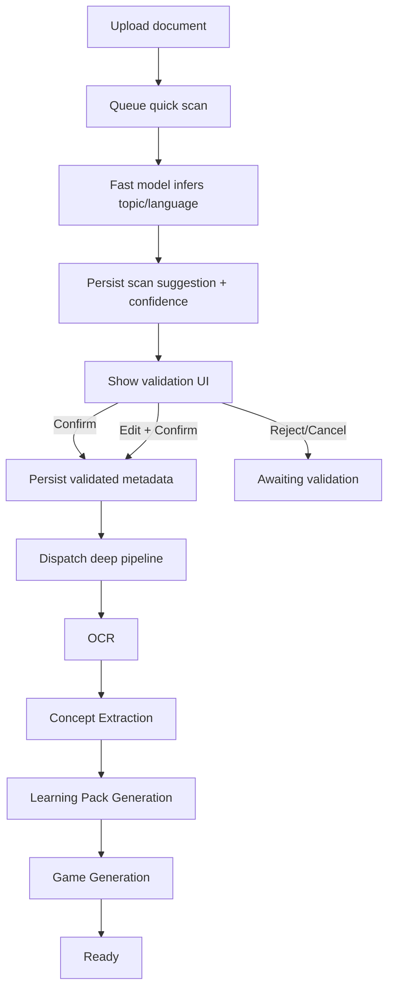

# ✨ feat: Two-Stage Document Scan Validation Before Game Generation

## Overview

Introduce a strict two-stage AI flow for uploaded documents:

1. **Fast scan stage (low latency):** immediately after upload, run a lightweight AI scan to infer **topic** and **language**.
2. **Human validation gate:** user reviews, edits if needed, then confirms.
3. **Deep generation stage:** only after confirmation, run full OCR/concept extraction/learning-pack/game generation.

This plan restructures the upload-to-generation pipeline to improve output quality, reduce wrong-language/wrong-topic generations, and make AI behavior explicit and trustable.

## Detail Level

`A LOT` (cross-cutting backend pipeline + mobile UX + telemetry + model strategy)

## Stakeholders

- End users (children): better-fit generated games by validated topic/language.
- Parents: clear control before costly generation starts.
- Mobile developers: new validation gate UI and document lifecycle states.
- Backend developers: split pipeline orchestration and confirmation endpoint.
- Operations: queue lane tuning and per-stage observability.

## Idea Refinement

- No brainstorm file found in `docs/brainstorms/`.
- Feature request is clear and actionable.
- Scope interpreted as:
  - Upload must trigger fast AI scan automatically.
  - Deep generation must be blocked until user validates topic/language.

## Local Research Summary

### Repo Findings

- Upload currently dispatches OCR immediately (no validation gate):
  - `backend/app/Http/Controllers/Api/DocumentController.php:124`
- Existing async pipeline sequence is:
  - OCR (`ProcessDocumentOcr`) -> concept extraction -> learning pack -> games:
  - `backend/app/Jobs/ProcessDocumentOcr.php:16`
  - `backend/app/Jobs/ExtractConceptsFromDocument.php:17`
  - `backend/app/Jobs/GenerateLearningPackFromDocument.php:18`
  - `backend/app/Jobs/GenerateGamesFromLearningPack.php:18`
- Queue lanes already exist and are explicit (`ocr`, `concepts`, `pack`, `games`):
  - `backend/app/Jobs/ProcessDocumentOcr.php:22`
  - `backend/app/Jobs/ExtractConceptsFromDocument.php:23`
  - `backend/app/Jobs/GenerateLearningPackFromDocument.php:24`
  - `backend/app/Jobs/GenerateGamesFromLearningPack.php:24`
- Metadata suggestion endpoint exists, but it is decoupled from upload and not required:
  - `backend/routes/api.php:42`
  - `backend/app/Http/Controllers/Api/DocumentMetadataSuggestionController.php:15`
- Current metadata suggestion service is lightweight heuristic logic, not full document scan:
  - `backend/app/Services/Documents/MetadataSuggestionService.php:11`
- Flutter upload/review screens offer optional “Suggest Metadata with AI” button before upload confirmation:
  - `mobile/learny_app/lib/screens/documents/upload_screen.dart:114`
  - `mobile/learny_app/lib/screens/documents/review_screen.dart:101`
- App state currently uploads then starts polling generation status right away:
  - `mobile/learny_app/lib/state/app_state.dart:840`
  - `mobile/learny_app/lib/state/app_state.dart:1282`

### Institutional Learnings

- No `docs/solutions/` entries were found for this feature area.
- Related historical plan with partial overlap:
  - `docs/plans/2026-02-06-feat-smart-revision-upload-speed-memory-loop-plan.md:391`

## Research Decision

Proceeding **with** external research.

Reason: this feature depends on external model behavior, model/version lifecycle, and provider routing/data policy controls. The topic is medium-high risk for cost, latency, and privacy if misconfigured.

## External Research Summary

- Laravel queues support sequential chains and batch orchestration, which fits a gated two-phase pipeline:
  - [Laravel Queues 12.x](https://laravel.com/docs/12.x/queues)
- OpenRouter supports provider routing controls (`order`, `allow_fallbacks`, `data_collection`, `zdr`) and explicit sort strategies for throughput/latency:
  - [OpenRouter Provider Routing](https://openrouter.ai/docs/guides/routing/provider-selection)
  - [OpenRouter Models API Metadata](https://openrouter.ai/docs/guides/overview/models)
- Gemini model catalog shows clear fast-tier options and model lifecycle/deprecation signals (relevant for avoiding soon-to-retire models):
  - [Gemini Models](https://ai.google.dev/gemini-api/docs/models)
- Mistral OCR docs confirm support for structured OCR outputs, page selection, and scale/batch guidance, useful for quick-scan extraction strategy:
  - [Mistral OCR Processor](https://docs.mistral.ai/capabilities/document_ai/basic_ocr)
  - [Mistral OCR API Endpoint](https://docs.mistral.ai/api/endpoint/ocr)

## Problem Statement

Today, generation can start before topic/language are validated against the actual uploaded content. This causes:

- wrong language outputs,
- mis-scoped topic generation,
- wasted token spend on incorrect deep generation,
- lower trust because users cannot explicitly confirm AI interpretation first.

## Proposed Solution

Split upload processing into **Scan** and **Generate** modes with a hard user gate:

1. Upload document as usual.
2. Queue `quick_scan` job with a fast model strategy.
3. Persist suggested `topic` + `language` + confidence/alternatives.
4. Show validation UI (accept/edit).
5. `confirm` endpoint persists final metadata and dispatches deep pipeline jobs.
6. Existing deep pipeline runs unchanged after confirmation.

## SpecFlow Analysis

### Primary User Flows

1. Parent uploads document -> quick scan completes -> suggestions shown -> parent confirms -> generation starts -> first game ready.
2. Parent edits topic/language before confirming -> edited values become authoritative context for generation.
3. Parent rejects scan -> can re-scan or manually set values.
4. Parent leaves before confirming -> document remains `awaiting_validation` and resumable from library.

### Edge Cases

- Low-confidence scan suggestions.
- Mixed-language documents.
- No detectable topic/language (empty/poor scan).
- Double-confirm requests (idempotency required).
- Confirm after stale re-scan result.
- Concurrent regenerate while awaiting validation.

### Required Spec Clarifications (resolved in this plan)

- **Gate policy:** deep generation MUST NOT start before validation.
- **Fallback policy:** user manual override always wins over scan suggestion.
- **TTL policy:** unconfirmed scans remain in pending state; no auto-generate fallback.

## Technical Approach

### Pipeline State Model

Add/extend document lifecycle stages:

- `queued`
- `quick_scan_queued`
- `quick_scan_processing`
- `awaiting_validation`
- `ocr`
- `concept_extraction`
- `learning_pack_generation`
- `game_generation`
- `ready`
- `*_failed`

### High-Level Flow



### Data Contract Changes

Extend `Document` metadata fields (or nested scan object):

- `scan_status` (`queued|processing|ready|failed`)
- `scan_topic_suggestion` (string)
- `scan_language_suggestion` (string)
- `scan_confidence` (float)
- `scan_alternatives` (array)
- `scan_model` (string)
- `scan_completed_at` (datetime)
- `validation_status` (`pending|confirmed|rejected`)
- `validated_topic` (string)
- `validated_language` (string)
- `validated_at` (datetime)

### API Additions/Changes

- Keep: `POST /api/v1/children/{child}/documents` (upload)
  - new behavior: starts quick scan, **does not** dispatch deep pipeline.
- Add: `GET /api/v1/children/{child}/documents/{document}/scan`
  - returns scan status + suggestions.
- Add: `POST /api/v1/children/{child}/documents/{document}/confirm-scan`
  - body: `{ topic, language }`
  - validates and dispatches deep pipeline.
- Add: optional `POST /api/v1/children/{child}/documents/{document}/rescan`.

### Mobile UX Changes

- After upload/review, route to “Validate AI Scan” step.
- Display:
  - suggested topic,
  - suggested language,
  - confidence,
  - alternatives.
- Actions:
  - `Confirm & Generate`
  - `Edit & Confirm`
  - `Rescan`
  - `Cancel for now`.
- Library should show pending validation badge for incomplete uploads.

### Model Strategy

- **Fast scan model:** low-latency/cost model profile for topic/language extraction only.
- **Deep generation model:** existing richer model path for concept and game generation.
- Use provider controls for reliability/privacy when needed (`allow_fallbacks`, `zdr`, `data_collection`).

## Implementation Phases

### Phase 1: Backend Scan Gate Foundation

Files:

- `backend/app/Http/Controllers/Api/DocumentController.php`
- `backend/app/Models/Document.php`
- `backend/app/Support/Documents/PipelineTelemetry.php`
- `backend/routes/api.php`
- `backend/tests/Feature/DocumentUploadTest.php`

Tasks:

- [x] Stop dispatching deep pipeline directly in upload path.
- [x] Add quick-scan stage transitions and progress hints.
- [x] Persist scan + validation fields on `Document`.
- [x] Keep backward-compatible response contract for upload.

### Phase 2: Quick Scan Job and Service

Files:

- `backend/app/Jobs/QuickScanDocumentMetadata.php` (new)
- `backend/app/Services/Documents/QuickScanService.php` (new)
- `backend/config/prism.php`
- `backend/tests/Feature/DocumentMetadataSuggestionTest.php`
- `backend/tests/Feature/OcrJobTest.php`

Tasks:

- [x] Add queue lane `scan` for quick scan jobs.
- [x] Implement fast extraction prompt/schema for topic/language.
- [x] Return confidence + alternatives.
- [x] Handle scan failures with retry + clear user-facing fallback state.

Pseudo-code:

```php
// backend/app/Jobs/QuickScanDocumentMetadata.php
public function handle(QuickScanService $scan): void {
  $document = Document::find($this->documentId);
  PipelineTelemetry::transition($document, 'quick_scan_processing', 20, 'processing');
  $result = $scan->scan($document); // topic, language, confidence, alternatives
  $document->scan_status = 'ready';
  $document->validation_status = 'pending';
  $document->scan_topic_suggestion = $result['topic'];
  $document->scan_language_suggestion = $result['language'];
  $document->save();
  PipelineTelemetry::transition($document, 'awaiting_validation', 30, 'queued');
}
```

### Phase 3: Confirmation Endpoint and Deep Pipeline Trigger

Files:

- `backend/app/Http/Controllers/Api/DocumentScanConfirmationController.php` (new)
- `backend/routes/api.php`
- `backend/app/Jobs/ProcessDocumentOcr.php`
- `backend/tests/Feature/GenerationPipelineTest.php`

Tasks:

- [x] Add confirm endpoint with ownership + idempotency checks.
- [x] Persist user-edited topic/language as canonical generation context.
- [x] Dispatch `ProcessDocumentOcr` only on confirmed scan.
- [x] Guard against duplicate dispatch if already confirmed.

Pseudo-code:

```php
// backend/app/Http/Controllers/Api/DocumentScanConfirmationController.php
public function confirm(Request $request, string $childId, string $documentId) {
  $data = $request->validate([
    'topic' => ['required', 'string', 'max:120'],
    'language' => ['required', 'string', 'max:32'],
  ]);

  $document = $this->findOwnedDocument($childId, $documentId);
  if ($document->validation_status === 'confirmed') {
    return response()->json(['data' => $document]);
  }

  $document->subject = $data['topic'];
  $document->language = $data['language'];
  $document->validation_status = 'confirmed';
  $document->validated_at = now();
  $document->save();

  ProcessDocumentOcr::dispatch((string) $document->_id);
  return response()->json(['data' => $document], 202);
}
```

### Phase 4: Flutter Validation Step

Files:

- `mobile/learny_app/lib/screens/documents/review_screen.dart`
- `mobile/learny_app/lib/screens/documents/upload_screen.dart`
- `mobile/learny_app/lib/screens/documents/processing_screen.dart`
- `mobile/learny_app/lib/state/app_state.dart`
- `mobile/learny_app/lib/services/backend_client.dart`
- `mobile/learny_app/lib/l10n/app_en.arb`
- `mobile/learny_app/lib/l10n/app_fr.arb`
- `mobile/learny_app/lib/l10n/app_nl.arb`

Tasks:

- [x] Add dedicated validation step and API calls (`get scan`, `confirm scan`, `rescan`).
- [x] Prevent processing screen from entering deep-stage polling until confirmation.
- [x] Show pending-validation status in library listing.
- [x] Add localized copy for validation actions and explanations.

### Phase 5: Telemetry, QA, and Rollout

Files:

- `backend/app/Support/Documents/PipelineTelemetry.php`
- `backend/tests/Feature/DocumentUploadTest.php`
- `backend/tests/Feature/GenerationPipelineTest.php`
- `mobile/learny_app/test/state/app_state_result_submission_test.dart`
- `mobile/learny_app/test/widget_test.dart`

Tasks:

- [x] Track quick-scan latency and validation-to-start delay.
- [ ] Track acceptance/edit/reject rates for scan suggestions.
- [ ] Add backend and Flutter tests for gated progression and retries.
- [ ] Roll out behind a feature flag for staged activation.

## Acceptance Criteria

### Functional

- [x] Upload always triggers quick scan before deep generation.
- [x] User can view/edit topic and language suggestions.
- [x] Deep generation only starts after explicit confirmation.
- [x] Confirm endpoint is idempotent.
- [x] Library and processing states reflect pending validation correctly.

### Non-Functional

- [ ] P95 quick-scan response time stays under agreed threshold.
- [x] Scan failures are recoverable without re-upload.
- [ ] Data policy controls for model routing are configurable.

### Quality Gates

- [x] Feature and regression tests pass for upload -> validate -> generate flow.
- [x] No regression in existing OCR/concept/game generation stages.
- [ ] Observability dashboard includes quick-scan and validation metrics.

## Success Metrics

- Reduction in wrong-language game generation rate.
- Reduction in regenerate actions caused by bad topic/language inference.
- Faster perceived “time to confidence” for parent before deep processing.
- Stable or improved upload-to-first-playable after gate introduction.

## Dependencies & Risks

### Dependencies

- Fast model/provider selection and credentials.
- API contract updates between backend and Flutter.
- Queue worker capacity for new `scan` lane.

### Risks and Mitigations

- Risk: added step may increase abandonment.
  - Mitigation: make validation screen fast, prefilled, and one-tap confirm.
- Risk: scan quality low on poor images.
  - Mitigation: expose confidence + alternatives + manual override.
- Risk: model/version drift or deprecation.
  - Mitigation: centralize model config and maintain version fallback strategy.
- Risk: privacy constraints on provider routing.
  - Mitigation: support provider policy knobs (`data_collection`, `zdr`) for sensitive contexts.

## AI-Era Considerations

- Keep lightweight scan prompt narrowly scoped (topic/language only).
- Use structured response contracts for scan outputs.
- Record model name/version used for each scan for auditability.
- Require human confirmation before high-cost generation.

## Testing Plan

- Backend integration:
  - upload creates pending-validation document;
  - quick scan populates suggestions;
  - confirm triggers deep pipeline once;
  - reject/rescan paths remain consistent.
- Mobile widget/state:
  - validation screen rendering and actions;
  - pending-validation library badge;
  - processing stage transitions after confirm.
- End-to-end:
  - photo/PDF upload -> validate -> ready game in all supported locales.

## References & Research

### Internal References

- `backend/app/Http/Controllers/Api/DocumentController.php:124`
- `backend/app/Services/Documents/MetadataSuggestionService.php:11`
- `backend/app/Jobs/ProcessDocumentOcr.php:16`
- `backend/app/Jobs/ExtractConceptsFromDocument.php:17`
- `backend/app/Jobs/GenerateLearningPackFromDocument.php:18`
- `backend/app/Jobs/GenerateGamesFromLearningPack.php:18`
- `backend/app/Support/Documents/PipelineTelemetry.php:10`
- `mobile/learny_app/lib/state/app_state.dart:840`
- `mobile/learny_app/lib/screens/documents/upload_screen.dart:114`
- `mobile/learny_app/lib/screens/documents/review_screen.dart:101`

### External References

- Laravel Queues (chains, batches, workers): [https://laravel.com/docs/12.x/queues](https://laravel.com/docs/12.x/queues)
- OpenRouter Provider Routing: [https://openrouter.ai/docs/guides/routing/provider-selection](https://openrouter.ai/docs/guides/routing/provider-selection)
- OpenRouter Models API schema metadata: [https://openrouter.ai/docs/guides/overview/models](https://openrouter.ai/docs/guides/overview/models)
- Gemini model capabilities and version lifecycle: [https://ai.google.dev/gemini-api/docs/models](https://ai.google.dev/gemini-api/docs/models)
- Mistral Document AI OCR: [https://docs.mistral.ai/capabilities/document_ai/basic_ocr](https://docs.mistral.ai/capabilities/document_ai/basic_ocr)
- Mistral OCR API endpoint details: [https://docs.mistral.ai/api/endpoint/ocr](https://docs.mistral.ai/api/endpoint/ocr)

### Related Work

- `docs/plans/2026-02-06-feat-smart-revision-upload-speed-memory-loop-plan.md`
- `docs/plans/2026-02-06-feat-complete-quiz-learning-pipeline-plan.md`

## Final Checklist

- [x] Searchable, descriptive title and date-based filename.
- [x] Issue type set to `feat`.
- [x] Acceptance criteria are measurable.
- [x] Includes explicit files for implementation and pseudo code blocks.
- [x] Includes flow analysis, edge cases, and rollout/testing guidance.
